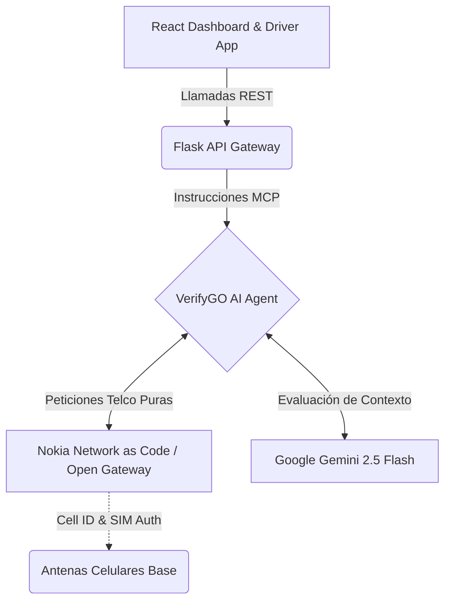

<div align="center">
  <h1>VerifyGO 🚚🛡️</h1>
  <p><strong>Open Gateway Hackathon 2026 — Prueba de Concepto Funcional</strong></p>

  [](https://python.org)
  [](https://reactjs.org/)
  [](https://deepmind.google/technologies/gemini/)
  [](https://network.nokia.com/)
</div>

<br>

**VerifyGO** (anteriormente *FleetSync AI*) es un sistema avanzado de ciberseguridad y monitorización en tiempo real para flotas logísticas. Combina el poder inmutable de las redes de telecomunicaciones comerciales (**Nokia Network as Code**) con la capacidad analítica de la Inteligencia Artificial Generativa (**Gemini 2.5 Flash**) para validar de forma determinista la integridad de cada envío a nivel celular.

## 🎯 El Problema y la Solución

En logística moderna, **el posicionamiento GPS es vulnerable**. Los atacantes y clanes de robo de mercancía pueden realizar *spoofing* o inhibición de coordenadas con relativa facilidad. 

**Nuestra solución:** Los delincuentes pueden engañar al receptor satelital del camión, pero **no pueden falsificar la red celular**. VerifyGO utiliza el protocolo internacional *Open Gateway* a través de Nokia NaC para consultar directamente contra las antenas de la operadora móvil la ubicación real y el estado criptográfico de la SIM de cada conductor, garantizando seguridad absoluta (Arquitectura "Zero-Trust" Logística).

---

## ✨ Características Principales

*   🔒 **Verificación Inmutable de Ubicación:** Validación cruzada en tiempo real entre las coordenadas reportadas por la app del conductor, el dispositivo de telemetría del camión, y la posición real validada por la torre de red de la operadora.
*   📱 **Detección de SIM Swap:** Alerta inmediata y denegación de encendido/autorización si los registros de la Telco indican que la tarjeta SIM del conductor ha sido clonada o intercambiada de dispositivo recientemente.
*   ⚡ **Priorización Inteligente de Red (QoD):** Activación automatizada de *Quality on Demand* para otorgar ancho de banda crítico y mínima latencia a los sensores logísticos cuando el camión atraviesa zonas grises o rutas largas.
*   🧠 **Orquestación con IA Generativa:** Un agente cognitivo basado en Gemini 2.5 Flash ingiere toda la biometría de red devuelta por Nokia y evalúa los contextos dinámicos devolviendo veredictos estructurados JSON (`AUTHORIZED`, `DENIED`, `ALERT`, `ARRIVED`).
*   📊 **Dashboard de Operaciones (Tiempo Real):** Panel de control táctico construido en React para la visualización de la flota activa, alertas de SIM/GPS e historial auditable de decisiones de la IA.

---

## 🏗️ Arquitectura de la Solución

El sistema opera bajo un paradigma de agente autónomo híbrido que utiliza **Model Context Protocol (MCP)** para consumir las APIs Telco de forma estandarizada.



---

## 🔄 Los 4 Core Flows Telco Activos

VerifyGO audita pasiva y activamente los camiones a través de **4 comprobaciones de nivel de telecomunicación** integradas en el ciclo de vida del transporte:

| FASE DE RUTA | TRIGGER LOGÍSTICO | APIS DE RED INVOCADAS (NOKIA) | ROL DE LA INTELIGENCIA ARTIFICIAL |
| :--- | :--- | :--- | :--- |
| **1. Validación de Inicio** | Conductor pulsa *Start Journey* | `checkSimSwap` <br> `verifyLocation` <br> `verifyTruckChip` | Verifica si el móvil está donde dice estar, si coincide con el camión físico y si la SIM es legítima antes de encender motor. |
| **2. Reserva de Ancho de Banda** | Ruta programada > 50 km | `createSession-QoD-V1` | El Agente reserva proactivamente un carril rápido (Quality on Demand) en la red 5G según la distancia del trayecto. |
| **3. Ghost Monitoring** | Job asíncrono (cada 5 min) | `verifyLocation` <br> `checkRouteDeviation` | Previene desvíos o secuestros del teléfono/camión en plena autopista validando silenciosamente con las antenas locales. |
| **4. Acuse de Recibo** | Conductor pulsa *I have arrived* | `verifyLocation` <br> `retrieveLocation` | Certifica la entrega en el cliente final **solamente** si el conductor está físicamente dentro del radio geofence de destino a nivel torre celular. |

---

## 💻 Guía de Despliegue para Evaluación

El proyecto es un Monolito Modular con **Backend** estructurado en Python / Flask y **Frontend** en Node.js / React.

### 1. Requisitos Técnicos
- **Python 3.10** o superior.
- **Node.js 18** o superior.
- Token generativo de Google AI Studio (`GEMINI_API_KEY`).
- Claves corporativas de Nokia Network as Code (vía Sandbox RapidAPI).

### 2. Preparación del Entorno

```bash
# 1. Clonar el repositorio
git clone <url-del-repositorio>
cd VerifyGo

# 2. Levantar el Virtual Environment de Python
python3 -m venv .venv
source .venv/bin/activate  # Alternativa Windows: .venv\Scripts\activate

# 3. Instalar librerías de Agentes, Flask y Red
pip install -r requirements.txt

# 4. Compilar UI Management
cd frontend
npm install
cd ..

# 5. Generar archivo de configuración secreta
cp .env.example .env
```

### 3. Modificación de Variables `.env`
Edita tu nuevo archivo `.env` en la ruta base con las credenciales entregadas en el Hackathon:

```ini
GEMINI_API_KEY=tu_token_llm_aqui
NOKIA_NAC_API_KEY=tu_token_rapid_api_aqui
NOKIA_NAC_API_HOST=network-as-code.nokia.rapidapi.com
NOKIA_NAC_MCP_URL=https://mcp-eu.rapidapi.com
```

---

## 🚀 Arranque del Sistema

Abre dos sesiones de terminal para levantar paralelamente el orquestador backend de IA y el cliente React de visualización.

**Terminal 1: Orquestador AI (Backend) 🐍**
```bash
source .venv/bin/activate
python start.py
```

**Terminal 2: Centro de Mando (Frontend) ⚛️**
```bash
cd frontend
npm run dev
```

> **Los nodos estarán disponibles en su máquina local:**
> 🌐 **Dashboard Operativo:** [http://localhost:3000](http://localhost:3000)
> 📱 **Terminal del Conductor (Recomendado vista móvil):** [http://localhost:3000/driver](http://localhost:3000/driver)

---

## 🎮 Sandboxing y Simulaciones de Amenaza

La aplicación contiene fixtures generadas para simular un día logístico crítico. Emplea las cuentas subyacentes para testear la resiliencia de VerifyGO.

#### 👥 Identidades Virtuales Habilitadas:
| Número de Login | Piloto Asignado | Vehículo Tracker | Corredor Logístico |
| :--- | :--- | :--- | :--- |
| `+99999991000` | Carlos Rodríguez | TRK-001 | Madrid → Barcelona (621 km) |
| `+99999991001` | Ana García | TRK-002 | Barcelona → Zaragoza (296 km) |

#### 🚨 Inyección de Vectores de Ataque (Mediante Panel de Admin)
Una vez que el viaje logístico inicie, puedes lanzar los siguientes payloads desde la pestaña del entorno simulador en el Dashboard de Operaciones:

*   🔴 **GPS Spoofing:** Emula un bloqueador de señales en cabina manipulando el GPS reportado. VerifyGO solicitará la triangulación celular verídica y lanzará una excepción arquitectónica si no coinciden.
*   🔴 **SIM Swap Attack:** Simula un secuestro de la línea de teléfono de un conductor activo. Bloquea temporalmente transacciones logísticas entrantes o la certificación de entrega de los palets.
*   🔴 **Desviación Enmascarada:** Desvía silenciosamente al camión del corredor seguro designado.
*   🟢 **Manual QoS Override:** Simula una petición humana de emergencia obligando a las células 4G/5G a dar latencia <2ms al dispositivo de telemetría del camión vía QoD.

---

<p align="center">
  <br>
  Construido con ❤️ para la revolución digital. <br>
  <strong>Open Gateway Hackathon 2026</strong> por el equipo de ingeniería <strong>VerifyGO</strong>.
</p>
